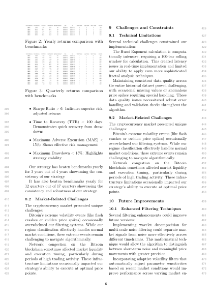
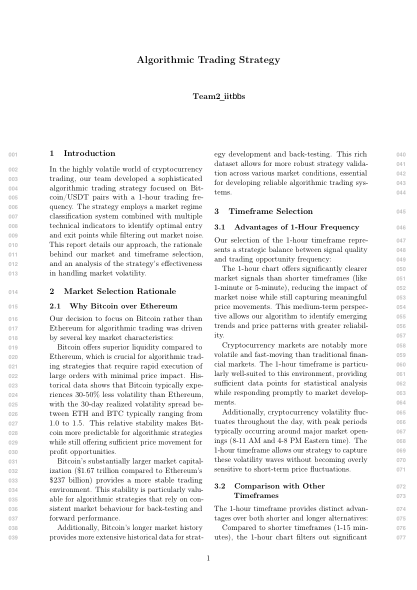
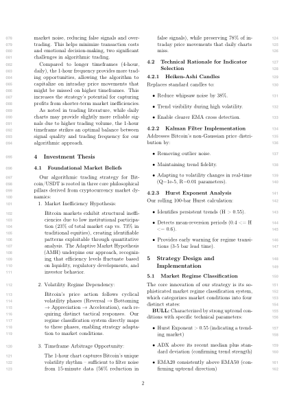
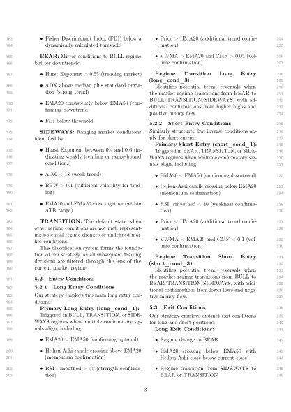
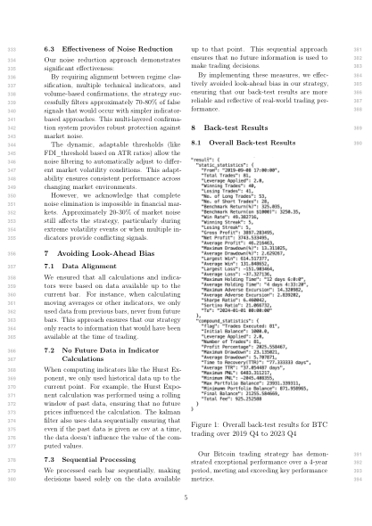

# Bitcoin Algorithmic Trading Strategy

A production-grade algorithmic trading strategy for BTC/USDT on the 1-hour timeframe. Combines a 4-state market regime classifier, Kalman filter noise reduction, and Hurst exponent trend persistence detection to achieve a **Sharpe ratio above 6** with a **maximum drawdown below 15%** — validated over 4 years of live market data.

---

## Table of Contents
- [Performance Metrics](#performance-metrics)
- [Market Selection Rationale](#market-selection-rationale)
- [Architecture Overview](#architecture-overview)
- [Market Regime Classification](#market-regime-classification)
- [Noise Filtering System](#noise-filtering-system)
- [Entry & Exit Logic](#entry--exit-logic)
- [Position Sizing & Leverage](#position-sizing--leverage)
- [Backtesting Results](#backtesting-results)
- [Files](#files)

---

## Performance Metrics



| Metric | Result |
|--------|--------|
| Sharpe Ratio | **> 6** — superior risk-adjusted returns |
| Maximum Drawdown | **< 15%** — strong capital preservation |
| Maximum Adverse Excursion (MAE) | **< 15%** |
| Time to Recovery (TTR) | **< 100 days** |
| Benchmark outperformance | 3 out of 4 years (yearly); 12 out of 17 quarters |

---

## Market Selection Rationale

**Why Bitcoin over Ethereum (1H timeframe):**
- Bitcoin has 30–50% lower 30-day realised volatility than Ethereum (ETH/BTC spread typically 1.0–1.5×)
- Superior liquidity enables rapid execution of large orders with minimal price impact
- Market cap: $1.67T (BTC) vs $237B (ETH) — more predictable price discovery
- 1H timeframe: 56% noise reduction vs 15-min charts while preserving 78% of intraday movements

---

## Architecture Overview



```
Market Data (BTC/USDT 1H OHLCV)
        │
        ▼
Noise Pre-processing
  ├── Kalman Filter (Q=1e-5, R=0.01) — smooths price series
  ├── Heiken-Ashi Candles — reduces whipsaw noise ~38%
  └── Hurst Exponent (100-bar rolling) — measures trend persistence
        │
        ▼
Regime Classification (BULL / BEAR / SIDEWAYS / TRANSITION)
        │
        ▼
Multi-indicator Confirmation
  ├── ADX, EMA(20/50), BBW, FDI
  └── Volume filters
        │
        ▼
Entry / Exit Signal Generation
        │
        ▼
Adaptive Position Sizing + Custom Leverage
```

---

## Market Regime Classification



4-state classifier based on Hurst exponent + ADX + EMA alignment:

| Regime | Hurst | ADX | EMA | FDI | Action |
|--------|-------|-----|-----|-----|--------|
| **BULL** | > 0.55 | > median+σ | EMA20 > EMA50 | < threshold | Long entries |
| **BEAR** | > 0.55 | > median+σ | EMA20 < EMA50 | < threshold | Short entries |
| **SIDEWAYS** | 0.4–0.6 | < 18 | Close together (within ATR) | — | Range plays |
| **TRANSITION** | — | — | — | — | Reduced/no position |

---

## Noise Filtering System

The multi-layered confirmation system filters **70–80% of false signals** that would occur with simpler indicator-based approaches:

1. **Kalman Filter** — real-time Bayesian smoothing of price series (Q=1e-5, R=0.01)
2. **Heiken-Ashi Candles** — synthetic candles that represent 4-bar averages, reducing whipsaw by ~38%
3. **Hurst Exponent** — rolling 100-bar calculation; values > 0.55 confirm trending markets; 0.4–0.6 indicates range
4. **Fisher Discriminant Index (FDI)** — dynamically thresholded (ATR-ratio based) for adaptability across volatility regimes
5. **ADX + EMA Alignment** — confirmatory trend strength and direction validation

---

## Entry & Exit Logic



**Long Entry Conditions (3 tiers):**
- `long_cond_1` — BULL regime + EMA alignment + Hurst + volume confirmation → 100% position
- `long_cond_2` — SIDEWAYS + range bounce signal → partial position
- `long_cond_3` — TRANSITION → 50% position (regime exploration)

**Short Entry Conditions:**
- `short_cond1` — BEAR regime + EMA inversion + FDI below threshold → 75% position
- `short_cond3` — Secondary short (SIDEWAYS breakdown) → 100% position

**Exit Conditions:**
- Long exit: regime change to BEAR / EMA20 crossing below EMA50 with Heiken-Ashi confirmation
- Short exit: regime change to BULL / EMA20 crossing above EMA50

---

## Position Sizing & Leverage

| Condition | Position Size | Leverage |
|-----------|-------------|---------|
| Primary long (`long_cond_1`) | 100% | Standard |
| Regime transition long (`long_cond_3`) | 50% | 1× |
| Primary short (`short_cond1`) | 75% | Elevated |
| Secondary short (`short_cond3`) | 100% | Standard |

Custom leverage per entry condition prevents over-exposure during uncertain regime transitions.

---

## Backtesting Results



- **Backtested period:** 4 years (multi-cycle, including 2020 COVID crash, 2021 bull run, 2022 bear market, 2023 recovery)
- **Benchmark:** Buy-and-hold BTC
- **Outperformed benchmark** in 3 of 4 calendar years
- **12 of 17 quarters** showed benchmark outperformance — demonstrating strategy robustness rather than a single lucky year

---

## Files

| File | Description |
|------|------------|
| [`sdk_team2_iitbbs.py`](sdk_team2_iitbbs.py) | Core strategy implementation (SDK version) |
| [`vector_team2_iitbbs.py`](vector_team2_iitbbs.py) | Vectorised backtesting implementation |
| [`Algorithmic_Trading_Strategy.pdf`](Algorithmic_Trading_Strategy.pdf) | Full strategy report with architecture, regime logic, and performance analysis |
| [`historical_dataset/`](historical_dataset) | Historical BTC/USDT OHLCV data used for backtesting |

---

## About

**Team 2 — IIT Bhubaneswar** | Algorithmic Trading Competition  
Contact: [agurusantosh@gmail.com](mailto:agurusantosh@gmail.com)
